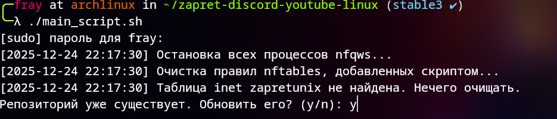
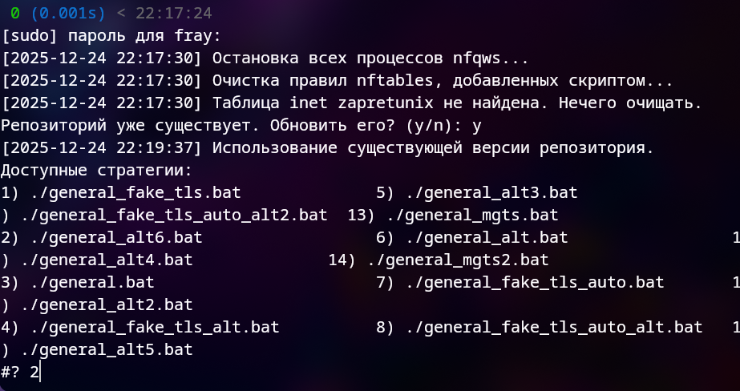
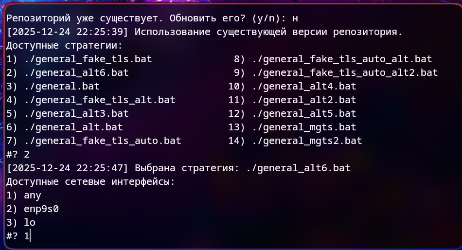
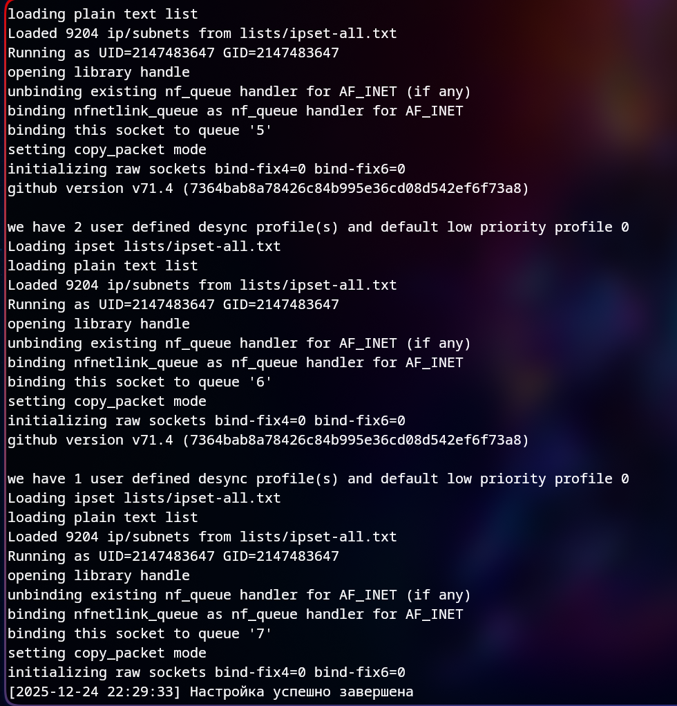

# Это уже настроенный запрет для игры в роблокс на Linux, **Это не мой запрет я лишь добавил обход для роблокса**

###  [оригинальный запрет](https://github.com/Sergeydigl3/zapret-discord-youtube-linux) был модифицирован мною, все что от вас требуется:
```
git clone https://github.com/fray580/roblox-zapret-for-linux.git
cd roblox-zapret-for-linux/zapret-discord-youtube-linux
./main_script.sh
```
------------------------------------------------------------------------
### Обновляем репозиторий


------------------------------------------------------------------------

выбираем **./general_alt6.bat** (другие **могут** не работать)
 
------------------------------------------------------------------------

выбираем **any**

-----

если все было **сделано верно** то будет такой вывод:

**Вот и все!**
------------------------------------------------------------------------

### Весь порядок команд:
- git clone https://github.com/fray580/roblox-zapret-for-linux.git
- cd roblox-zapret-for-linux
- ./main_script.sh
- *пароль sudo*
- y
- 2
- 1
- **наслаждаемся роблоксом**
